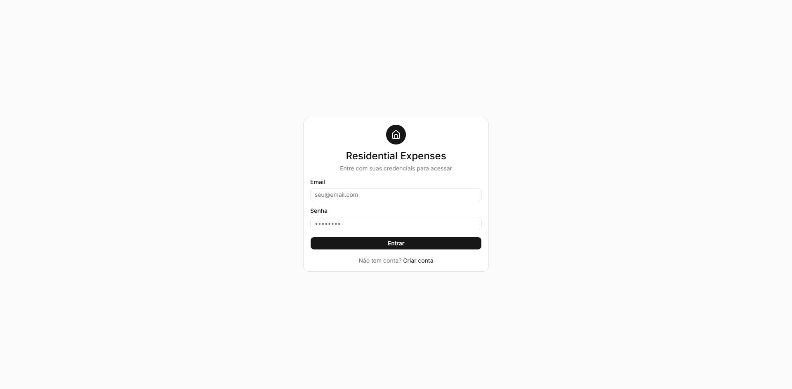
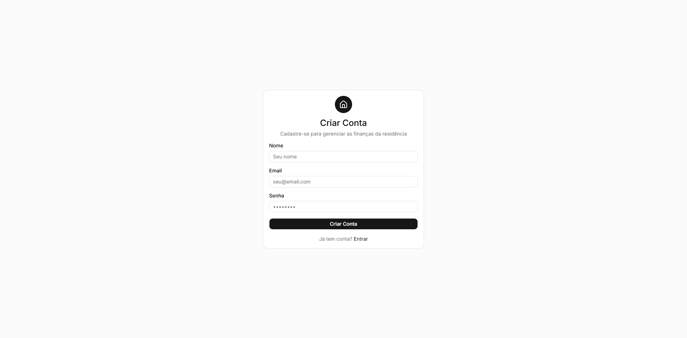
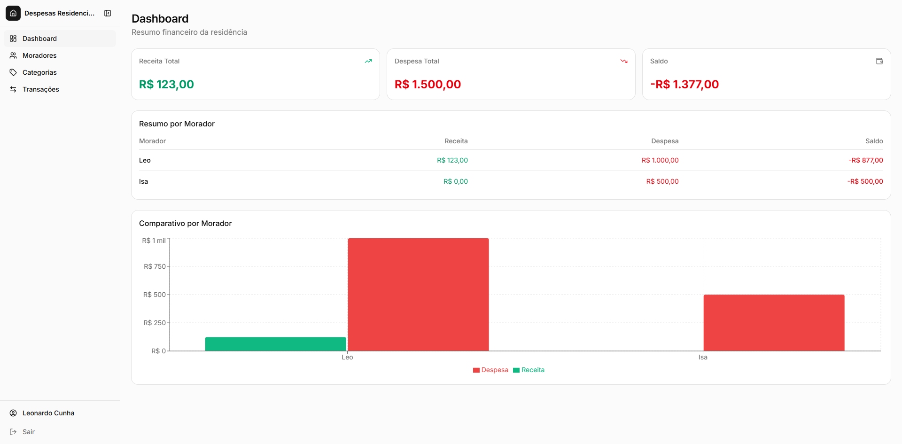
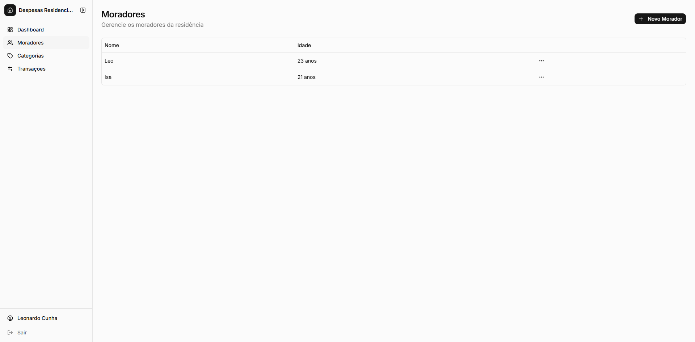
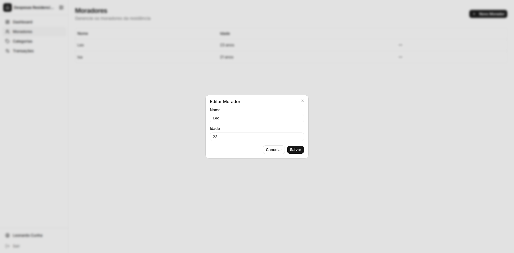
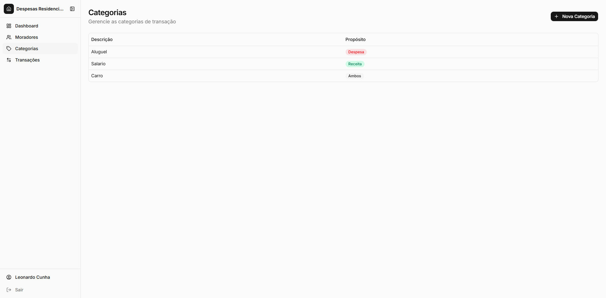
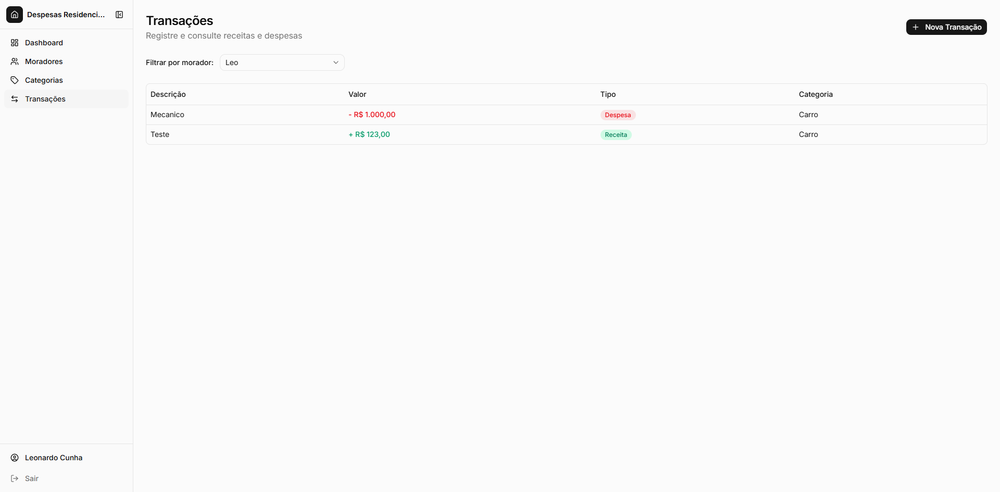
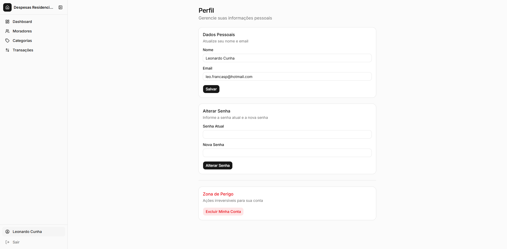

# Residential Expenses

Aplicação full-stack para gerenciamento de finanças residenciais compartilhadas. Permite que moradores de uma residência registrem receitas e despesas, categorizem transações e acompanhem o balanço financeiro individual e coletivo através de um dashboard interativo.

## Screenshots

<div align="center">

### Login & Registro

<p>
  
  
</p>

### Dashboard



### Moradores

<p>
  
  
</p>

### Categorias & Transações

<p>
  
  
</p>

### Perfil



</div>

## Funcionalidades

- **Autenticação** - Registro e login com JWT, senhas criptografadas com BCrypt
- **Dashboard** - Resumo financeiro com totais de receita, despesa e saldo por morador, gráfico comparativo
- **Moradores** - CRUD completo para gerenciar os moradores da residência
- **Categorias** - Criação de categorias com propósito (Despesa, Receita ou Ambos)
- **Transações** - Registro de receitas e despesas por morador e categoria, filtro por morador
- **Perfil** - Edição de dados pessoais, alteração de senha e exclusão de conta
- **Regra de negócio** - Menores de 18 anos só podem registrar despesas, não receitas

## Tech Stack

### Backend

| Tecnologia            | Versão | Uso                   |
| --------------------- | ------ | --------------------- |
| .NET / ASP.NET Core   | 9.0    | Framework web         |
| Entity Framework Core | 9.0    | ORM                   |
| PostgreSQL            | 15     | Banco de dados        |
| JWT                   | -      | Autenticação          |
| BCrypt.Net            | 4.1    | Hash de senhas        |
| AutoMapper            | -      | Mapeamento de objetos |
| FluentValidation      | -      | Validação de requests |
| Scalar                | 2.13   | Documentação da API   |

### Frontend

| Tecnologia            | Versão     | Uso                                  |
| --------------------- | ---------- | ------------------------------------ |
| React                 | 19         | Biblioteca UI                        |
| TypeScript            | 6.0        | Tipagem estática                     |
| Vite                  | 8.0        | Build tool                           |
| React Router          | 7.14       | Roteamento                           |
| TanStack Query        | 5.96       | Gerenciamento de estado servidor     |
| React Hook Form + Zod | 7.72 / 4.3 | Formulários e validação              |
| TailwindCSS           | 4.2        | Estilização                          |
| shadcn/ui + Radix UI  | -          | Componentes UI                       |
| Recharts              | 3.8        | Gráficos                             |
| Axios                 | 1.14       | Cliente HTTP                         |
| Orval                 | 8.6        | Geração de hooks a partir da OpenAPI |

### Infraestrutura

| Tecnologia     | Uso                     |
| -------------- | ----------------------- |
| Docker Compose | Container do PostgreSQL |

## Arquitetura

### Backend - Clean Architecture

```
back/src/
├── ResidentialExpenses.API            # Controllers, Filters, Middleware
├── ResidentialExpenses.Application    # Use Cases, Validators, Mappings
├── ResidentialExpenses.Domain         # Entities, Enums, Repository Interfaces
├── ResidentialExpenses.Infrastructure # EF Core, Repositories, Security (JWT, BCrypt)
├── ResidentialExpenses.Communication  # Request/Response DTOs
└── ResidentialExpenses.Exceptions     # Custom Exceptions
```

### Frontend - Feature-based

```
front/src/
├── api/                # Axios instance + hooks gerados pelo Orval
├── components/
│   ├── ui/             # Componentes shadcn/ui
│   ├── layout/         # AppLayout, Sidebar, AuthGuard
│   ├── features/       # Dialogs de formulário por feature
│   └── shared/         # DataTable, ConfirmDialog, EmptyState
├── contexts/           # AuthContext + AuthProvider
├── constants/          # Enums e constantes
├── lib/                # Utilitários (formatCurrency, cn, etc.)
└── pages/              # Páginas (Login, Register, Dashboard, etc.)
```

### Modelo de Dados

```
User ←→ Person (N:N)     Person → Transaction (1:N)     Category → Transaction (1:N)
┌──────────┐              ┌──────────┐                    ┌──────────┐
│ User     │              │ Person   │                    │ Category │
├──────────┤  user_person ├──────────┤                    ├──────────┤
│ Id       │◄────────────►│ Id       │                    │ Id       │
│ Email    │              │ Name     │    ┌─────────────┐ │Descriptio│
│ Name     │              │ Age      │───►│ Transaction │◄│ Purpose  │
│ Password │              └──────────┘    ├─────────────┤ └──────────┘
│ CreatedAt│                              │ Id          │
└──────────┘                              │ Description │  Purpose:
                                          │ Value       │  0 = Despesa
                                          │ Type        │  1 = Receita
                                          │ PersonId    │  2 = Ambos
                                          │ CategoryId  │
                                          └─────────────┘  Type:
                                                           0 = Despesa
                                                           1 = Receita
```

## Pré-requisitos

- [.NET 9 SDK](https://dotnet.microsoft.com/download/dotnet/9.0)
- [Node.js](https://nodejs.org/) (v18+)
- [Docker](https://www.docker.com/) e Docker Compose

## Como Executar

### 1. Banco de Dados

Na raiz do projeto, crie um arquivo `.env`:

```env
POSTGRESQL_USERNAME=seu_usuario
POSTGRESQL_PASSWORD=sua_senha
POSTGRESQL_DATABASE=residentialexpenses
POSTGRESQL_PORT=5432
```

Suba o container do PostgreSQL:

```bash
docker compose up -d
```

### 2. Backend

```bash
cd back/src/ResidentialExpenses.API
```

Configure `appsettings.Development.json` com a connection string e chave JWT:

```json
{
  "Settings": {
    "Connection": {
      "DatabaseConnection": "Host=localhost;Port=5432;Database=residentialexpenses;Username=seu_usuario;Password=sua_senha;"
    },
    "Jwt": {
      "ExpiresMinutes": 120,
      "SigningKey": "sua-chave-secreta-com-pelo-menos-64-caracteres-aqui-para-seguranca"
    }
  }
}
```

Execute:

```bash
dotnet run
```

A API estará disponível em `https://localhost:7248`. A documentação interativa fica em `https://localhost:7248/scalar/v1`.

### 3. Frontend

```bash
cd front
npm install
```

Para gerar os hooks da API (requer backend rodando):

```bash
npm run generate
```

Inicie o servidor de desenvolvimento:

```bash
npm run dev
```

O frontend estará disponível em `http://localhost:5173`.

## Endpoints da API

### Autenticação

| Método   | Rota         | Descrição                | Auth |
| -------- | ------------ | ------------------------ | ---- |
| `POST`   | `/api/login` | Login do usuário         | Não  |
| `POST`   | `/api/user`  | Registro de novo usuário | Não  |
| `GET`    | `/api/user`  | Perfil do usuário        | Sim  |
| `PUT`    | `/api/user`  | Atualizar perfil         | Sim  |
| `DELETE` | `/api/user`  | Excluir conta            | Sim  |

### Moradores

| Método   | Rota               | Descrição         | Auth |
| -------- | ------------------ | ----------------- | ---- |
| `POST`   | `/api/person`      | Cadastrar morador | Sim  |
| `GET`    | `/api/person`      | Listar moradores  | Sim  |
| `PUT`    | `/api/person/{id}` | Atualizar morador | Sim  |
| `DELETE` | `/api/person/{id}` | Remover morador   | Sim  |

### Categorias

| Método | Rota            | Descrição         | Auth |
| ------ | --------------- | ----------------- | ---- |
| `POST` | `/api/category` | Criar categoria   | Sim  |
| `GET`  | `/api/category` | Listar categorias | Sim  |

### Transações

| Método | Rota                                 | Descrição              | Auth |
| ------ | ------------------------------------ | ---------------------- | ---- |
| `POST` | `/api/transaction`                   | Registrar transação    | Sim  |
| `GET`  | `/api/transaction/person/{personId}` | Transações por morador | Sim  |
| `GET`  | `/api/transaction/totals`            | Resumo de totais       | Sim  |

Todas as respostas seguem o formato envelope:

```json
{
  "success": true,
  "data": {},
  "errors": [],
  "metadata": {}
}
```

## Scripts Disponíveis

### Frontend (`front/`)

| Script                   | Descrição                                    |
| ------------------------ | -------------------------------------------- |
| `npm run dev`            | Servidor de desenvolvimento                  |
| `npm run build`          | Build de produção                            |
| `npm run preview`        | Preview do build                             |
| `npm run lint`           | Lint com ESLint                              |
| `npm run generate`       | Gera hooks da API via Orval (requer backend) |
| `npm run generate:local` | Gera hooks a partir do schema local          |

### Backend (`back/`)

| Comando        | Descrição         |
| -------------- | ----------------- |
| `dotnet run`   | Executa a API     |
| `dotnet build` | Compila o projeto |
| `dotnet test`  | Executa os testes |
